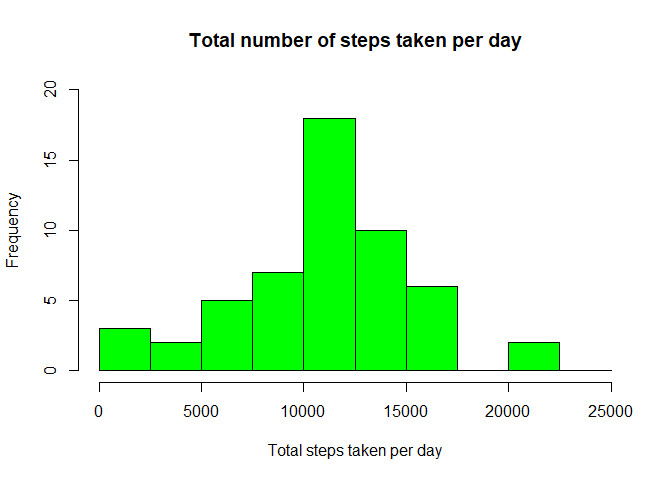
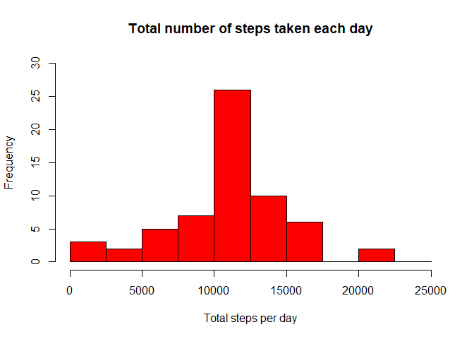
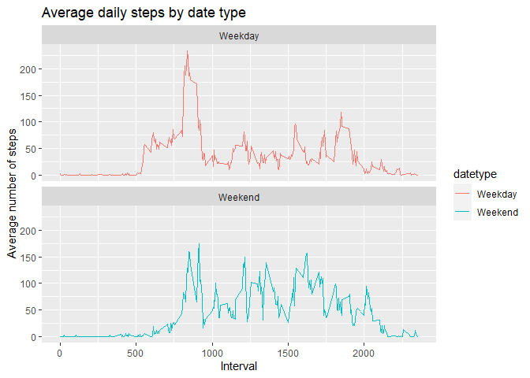

## 1. Loading and preprocessing the data

```r
library(ggplot2)

download.file("https://d396qusza40orc.cloudfront.net/repdata%2Fdata%2Factivity.zip", "activity_data.zip")
unzip("activity_data.zip")
activity <- read.csv("activity.csv")

activity$date<- as.Date(activity$date)
```


## 2. What is mean total number of steps taken per day?

### Histogram:

```r
activity.steps <- aggregate(steps ~ date, FUN = sum, data = activity)

names(activity.steps)<- c("dates", "steps")

hist(activity.steps$steps, main = "Total number of steps taken per day", xlab = "Total steps taken per day", col = "green", ylim = c(0,20), breaks = seq(0,25000, by=2500))
```

<!-- -->

### Mean and Median:
Mean of steps taken each day:

```r
mean.step <- mean(activity.steps$steps)
mean.step
```

```
## [1] 10766.19
```

Median number of steps taken each day:

```r
median.step <- median(activity.steps$steps)
median.step
```

```
## [1] 10765
```

## 3. What is the average daily activity pattern?

### Time series plot:

```r
steps_by_interval <- aggregate(steps ~ interval, FUN = mean , data = activity)

names(steps_by_interval)<-c("interval", "mean")

plot(steps_by_interval$interval,steps_by_interval$mean, type="l", xlab="Interval", ylab="Number of Steps",main="Average Number of Steps per Day by Interval")
```

<!-- -->

### The 5-minute interval contains the max number of steps:

```r
max_interval <- steps_by_interval[which.max(steps_by_interval$mean),1]
max_interval
```

```
## [1] 835
```
## 4. Imputing missing values

### Total number of missing values in the dataset

The total number of missing values are:

```r
NATotal <- sum(!complete.cases(activity))
NATotal
```

```
## [1] 2304
```
### Using Mean for the day to compute missing values


```r
clean.steps<- steps_by_interval$mean[match(activity$interval,steps_by_interval$interval)]
```

### Create a new dataset including the imputed missing value

```r
activity.clean <- transform(activity, steps = ifelse(is.na(activity$steps), yes = clean.steps, no = activity$steps))

total.clean.steps<- aggregate(steps ~ date, activity.clean, sum)

names(total.clean.steps)<- c("date", "daily.steps")
```

### Make a histogram of the total number of steps taken each day

```r
hist(total.clean.steps$daily.steps, col = "red", xlab = "Total steps per day", ylim = c(0,30), main = "Total number of steps taken each day", breaks = seq(0,25000,by=2500))
```

<!-- -->
### Mean

```r
mean.total <- mean(total.clean.steps$daily.steps)
mean.total
```

```
## [1] 10766.19
```

### Median

```r
median.total <- median(total.clean.steps$daily.steps)
median.total
```

```
## [1] 10766.19
```
### Difference in values from estimeastes from the first part of assignment

Difference in mean:

```r
meandiff <- mean.total - mean.step
meandiff
```

```
## [1] 0
```

Difference in median:

```r
mediandiff <- median.total - median.step
mediandiff
```

```
## [1] 1.188679
```
There is no difference in mean but difference in median. The impact of imputting missing data changes the frequency and variance.

## 5. Differences in activity patterns between weekdays and weekends

```r
activity$datetype <- sapply(activity$date, function(x) {
        if (weekdays(x) == "Saturday" | weekdays(x) =="Sunday") 
                {y <- "Weekend"} else 
                {y <- "Weekday"}
                y
        })

activity.datetype<- aggregate(steps~interval+datetype, activity,mean, na.rm =TRUE)
ggplot(activity.datetype, aes(x = interval, y = steps, color = datetype))+ geom_line() + labs(title = "Average daily steps by date type", x = "Interval", y = "Average number of steps") + facet_wrap(~datetype, ncol = 1, nrow = 2) 
```

<!-- -->

